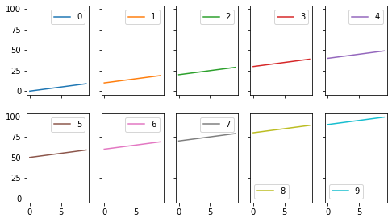

import Tabs from '@theme/Tabs';
import TabItem from '@theme/TabItem';

# Analysis Report: test[test]
- date: 2021/5/26
- author: takesei

## Overview
Test converting ipynb to markdown

## Data Location
- DUMMY URL
  - These files must be located in `./data`

---
```python
!pip install -r requirements.txt
```

<Tabs
defaultValue='stdout_batch'
values={[
{label: "STDOUT", value: 'stdout_batch'},
]}>

<TabItem value='stdout_batch'>

:::info STDOUT
```text
Requirement already satisfied: numpy==1.20.3 in /opt/conda/lib/python3.9/site-packages (from -r requirements.txt (line 4)) (1.20.3)

```
:::
</TabItem>
</Tabs>


---
```python
import os
from typing import NamedTuple

import matplotlib.pyplot as plt
import numpy as np
import pandas as pd
import seaborn as sns

import mylib as lib
```


---
```python
class ScriptConfig(NamedTuple):
    # Write the Constant Value here...
    input_dir: str = './data'
    output_dir: str = './output'

conf = ScriptConfig()
os.makedirs(conf.output_dir, exist_ok=True)

conf
```

<Tabs
defaultValue='text_plain_batch'
values={[
{label: "[Out]", value: 'text_plain_batch'},
]}>

<TabItem value='text_plain_batch'>

:::note Out
```text
ScriptConfig(input_dir='./data', output_dir='./output')
```
:::
</TabItem>
</Tabs>


---
```python
data = np.arange(100).reshape(10, -10).T
lib.multiplot(data)
```

<Tabs
defaultValue='image_png'
values={[
{label: "Image", value: 'image_png'},
{label: "[Out]", value: 'text_plain_batch'},
]}>

<TabItem value='image_png'>

:::note Image

:::
</TabItem>
<TabItem value='text_plain_batch'>

:::note Out
```text
<Figure size 576x324 with 10 Axes>
```
:::
</TabItem>
</Tabs>


---
```python
pd.DataFrame(data)
```

<Tabs
defaultValue='text_html'
values={[
{label: "HTML", value: 'text_html'},
{label: "[Out]", value: 'text_plain_batch'},
]}>

<TabItem value='text_html'>

:::note HTML
<div><table border="1" className="dataframe">  <thead>    <tr style={{textAlign:"right"}}>      <th></th>      <th>0</th>      <th>1</th>      <th>2</th>      <th>3</th>      <th>4</th>      <th>5</th>      <th>6</th>      <th>7</th>      <th>8</th>      <th>9</th>    </tr>  </thead>  <tbody>    <tr>      <th>0</th>      <td>0</td>      <td>10</td>      <td>20</td>      <td>30</td>      <td>40</td>      <td>50</td>      <td>60</td>      <td>70</td>      <td>80</td>      <td>90</td>    </tr>    <tr>      <th>1</th>      <td>1</td>      <td>11</td>      <td>21</td>      <td>31</td>      <td>41</td>      <td>51</td>      <td>61</td>      <td>71</td>      <td>81</td>      <td>91</td>    </tr>    <tr>      <th>2</th>      <td>2</td>      <td>12</td>      <td>22</td>      <td>32</td>      <td>42</td>      <td>52</td>      <td>62</td>      <td>72</td>      <td>82</td>      <td>92</td>    </tr>    <tr>      <th>3</th>      <td>3</td>      <td>13</td>      <td>23</td>      <td>33</td>      <td>43</td>      <td>53</td>      <td>63</td>      <td>73</td>      <td>83</td>      <td>93</td>    </tr>    <tr>      <th>4</th>      <td>4</td>      <td>14</td>      <td>24</td>      <td>34</td>      <td>44</td>      <td>54</td>      <td>64</td>      <td>74</td>      <td>84</td>      <td>94</td>    </tr>    <tr>      <th>5</th>      <td>5</td>      <td>15</td>      <td>25</td>      <td>35</td>      <td>45</td>      <td>55</td>      <td>65</td>      <td>75</td>      <td>85</td>      <td>95</td>    </tr>    <tr>      <th>6</th>      <td>6</td>      <td>16</td>      <td>26</td>      <td>36</td>      <td>46</td>      <td>56</td>      <td>66</td>      <td>76</td>      <td>86</td>      <td>96</td>    </tr>    <tr>      <th>7</th>      <td>7</td>      <td>17</td>      <td>27</td>      <td>37</td>      <td>47</td>      <td>57</td>      <td>67</td>      <td>77</td>      <td>87</td>      <td>97</td>    </tr>    <tr>      <th>8</th>      <td>8</td>      <td>18</td>      <td>28</td>      <td>38</td>      <td>48</td>      <td>58</td>      <td>68</td>      <td>78</td>      <td>88</td>      <td>98</td>    </tr>    <tr>      <th>9</th>      <td>9</td>      <td>19</td>      <td>29</td>      <td>39</td>      <td>49</td>      <td>59</td>      <td>69</td>      <td>79</td>      <td>89</td>      <td>99</td>    </tr>  </tbody></table></div>
:::
</TabItem>
<TabItem value='text_plain_batch'>

:::note Out
```text
   0   1   2   3   4   5   6   7   8   9
0  0  10  20  30  40  50  60  70  80  90
1  1  11  21  31  41  51  61  71  81  91
2  2  12  22  32  42  52  62  72  82  92
3  3  13  23  33  43  53  63  73  83  93
4  4  14  24  34  44  54  64  74  84  94
5  5  15  25  35  45  55  65  75  85  95
6  6  16  26  36  46  56  66  76  86  96
7  7  17  27  37  47  57  67  77  87  97
8  8  18  28  38  48  58  68  78  88  98
9  9  19  29  39  49  59  69  79  89  99
```
:::
</TabItem>
</Tabs>


---
```python
data.cumsum()
```

<Tabs
defaultValue='text_plain_batch'
values={[
{label: "[Out]", value: 'text_plain_batch'},
]}>

<TabItem value='text_plain_batch'>

:::note Out
```text
array([   0,   10,   30,   60,  100,  150,  210,  280,  360,  450,  451,
        462,  483,  514,  555,  606,  667,  738,  819,  910,  912,  924,
        946,  978, 1020, 1072, 1134, 1206, 1288, 1380, 1383, 1396, 1419,
       1452, 1495, 1548, 1611, 1684, 1767, 1860, 1864, 1878, 1902, 1936,
       1980, 2034, 2098, 2172, 2256, 2350, 2355, 2370, 2395, 2430, 2475,
       2530, 2595, 2670, 2755, 2850, 2856, 2872, 2898, 2934, 2980, 3036,
       3102, 3178, 3264, 3360, 3367, 3384, 3411, 3448, 3495, 3552, 3619,
       3696, 3783, 3880, 3888, 3906, 3934, 3972, 4020, 4078, 4146, 4224,
       4312, 4410, 4419, 4438, 4467, 4506, 4555, 4614, 4683, 4762, 4851,
       4950])
```
:::
</TabItem>
</Tabs>


---