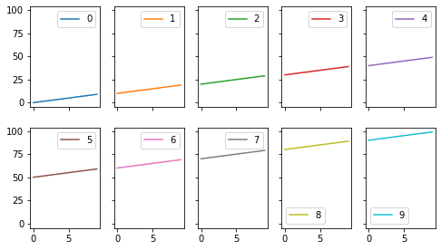

# Analysis Report: test[test]
- date: 2021/5/26
- author: takesei

## Overview
Test converting ipynb to markdown

## Data Location
- DUMMY URL
  - These files must be located in `./data`

---
```python
!pip install -r requirements.txt
```


:::info STDOUT
```text
Requirement already satisfied: numpy==1.20.3 in /opt/conda/lib/python3.9/site-packages (from -r requirements.txt (line 4)) (1.20.3)

```
:::


---
```python
import os
from typing import NamedTuple

import matplotlib.pyplot as plt
import numpy as np
import pandas as pd
import seaborn as sns

import mylib as lib
```


---
```python
class ScriptConfig(NamedTuple):
    # Write the Constant Value here...
    input_dir: str = './data'
    output_dir: str = './output'

conf = ScriptConfig()
os.makedirs(conf.output_dir, exist_ok=True)
```


---
```python
data = np.arange(100).reshape(10, -10).T
lib.multiplot(data)
```


:::note Out
<details>
<summary>Details</summary>
<span class='token-line'>
&lt;Figure size 576x324 with 10 Axes&gt;
</span>
</details>
:::


:::note Image

:::


---